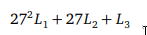

# TP5 Report

|        |             |
|:------:|:-----------:|
| A85272 | Jorge Mota  |
| A83840 | Maria Silva |

___

## First Part

In this part we had to solve 2 systems of congruences a) and b)

**Notes:** 

- We'll consider the defenition of a function `gcd(a,b)` that gives the <ins>greater common divisor</ins> of two values *a* and *b*.

- *k*,*l* and *m* are positive integers

- The congruences will be conversible to equations in the form:

`X ≣ a (mod b)`  ->  `X = b*k + a` , *k* being an positive integer

### **a )**

<pre><code>
(1): X ≣ 48 (mod 13)
(2): X ≣ 57 (mod 23)
(3): X ≣ 39 (mod 27)
</code></pre>

Firstly we begin with the congruency with largest modulus that is (3) `X ≣ 39 (mod 27)` 

Then we substitute this congruences expression for *X* into the congruence with the next largest modulus (2):

<pre><code>
27*m + 39 ≣ 57 (mod 23)
</code></pre>

Solving this Linear Congruency ...

<pre><code>
27*m ≣ 18 (mod 23)

note: gcd(27,23) = 1 so there is a solution

gcd(27,18) = 9

3*m ≣ 2 (mod 23)

3*m ≣ -21 (mod 23)

m ≣ -7 (mod 23)

m ≣ 16 (mod 23)

m = 23*k + 16
</code></pre>

Replacing the expression form of this result in the expression for *X* we get:

<pre><code>
X = 27*(23*l + 16) + 39
X = 621*l + 471
</code></pre>

Then we replace this expression in the last congruency (1) and solve this Linear Congruency

<pre><code>
621*l + 471 ≣ 48 (mod 13)

note: gcd(48,13) = 1 so there is a solution

621*l ≣ -423 (mod 13)

621*l ≣ 6 (mod 13)

207*l ≣ 2 (mod 13)

207*l ≣ -24 (mod 13)

gcd(24,207) = 3

69*l ≣ -8 (mod 13)

. . .

l ≣ 11 (mod 13)
</code></pre>

Finally we replace this in the expression obtained previously and get the solution 

<pre><code>
X = 621*(13*m + 11) + 471

X = 8073*m + 7302

X = 7302
</code></pre>

The smallest solution for this system is <ins>7302</ins>

### **b )**

For the second system the congruences we first simplified the each one to remove the coefficient 

<pre><code>
19*X ≣ 21 (mod 16)
37*X ≣ 100 (mod 15)
</code></pre>

Solving this Linear Congruences ...

<pre><code>
(1): X ≣ 7 (mod 16)
(2): X ≣ 10 (mod 15)
</code></pre>

With the same intension as before, we begin with the congruency with largest modulus that is (1) `X ≣ 7 (mod 16)`

Then we substitute this congruences expression for X into the congruence with the next largest modulus (2):

<pre><code>
16*k + 7 ≣ 10 (mod 15)
</code></pre>

Solving this Linear Congruence ...

<pre><code>
k ≣ 3 (mod 15)

k = 15*l + 3
</code></pre>

Replacing the expression form of this result in the expression for X we get:

<pre><code>
X = 16*(15*l + 3) + 7

X = 240*l + 55

X = 55
</code></pre>

The smallest solution for this system is <ins>55</ins>
___
## Second Part

For this part we had the objective to decrypt a cipher which was encrypted with RSA with e = 17 and n = 213271, beyond this, the ciphered integer was a result of an encoding of three letters in a row in the form:

For this encoding we developd two functions to make conversions in this scheme:

<pre><code>
n = encode(l1, l2, l3)
l1, l2, l3 = decode(n)
</code></pre>

Firstly, since we know the public key, and that the value of the modulus is small, we can compute the prime factorization in relevant time since this value isn't bigger enough.

The key concept in RSA is that it is based on a trapdoor function, a function that is easy to compute one way but difficult in the opposite direction unless we know the value *t*.

For the RSA this function is:

More specificly, we can compute the private key *d*:

(1) d = e−1 mod t

The private key can be computed knowing *e*, and the prime factorization of *n* as *p* and *q*

*t* is the trapdoor value which can be computed as the Least Common Multiple of *p* and *q* (`lcm(p,q)`).

To obtain this value we developed the following auxiliar functions:

<pre><code>
gcd(a,b)
t = lcm(a,b)
</code></pre>

For the prime factorization we provided a function `prime_factorization(n)` that returns a list of all prime factors

Finally, we apply (1) with all the data and obtain the value *d* that is the private/decryption key (together with *n*)

Once we obtain this value *d* we can decrypt the ciphertext and obtain the plaintext by decoding by the specified scheme.

<pre><code>
for c in cipher:
    l1,l2,l3 = decode((c**d) % n)
</code></pre>

After joining every letter decripted we obtain the full plaintext, this text can be found in the file `plaintext.txt` provided
